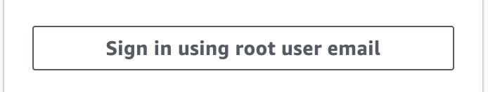
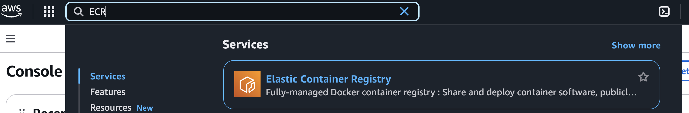
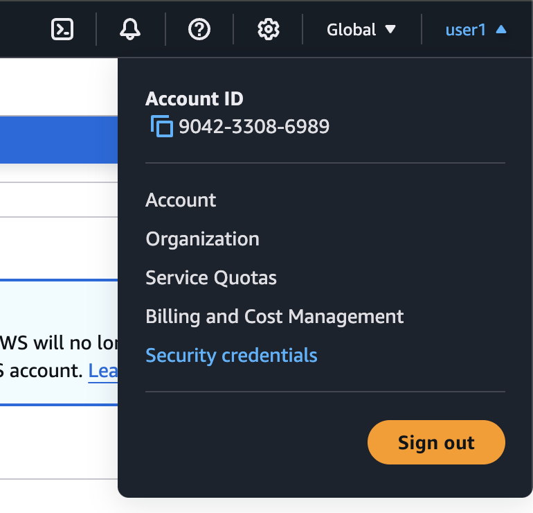

# Exercise 5: Push Docker image to AWS Elastic Container Registry (ECR)

In this exercise, you will push the Docker image for the Todos.Api project to AWS Elastic Container Registry (ECR). AWS ECR is a fully managed container registry that makes it easy to store, manage, share, and deploy Docker container images.

## Pre-requisites

- [Docker](https://docs.docker.com/get-docker/)
- [AWS CLI](https://docs.aws.amazon.com/cli/latest/userguide/cli-chap-install.html)

## Instructions

1. Get credentials from you trainer how to access aws account.
2. Go to https://console.aws.amazon.com/. And login with the credentials using "root user email" option:



3. Make sure you are in Frankfurt region (eu-central-1)


4. Go to ECR service by searching for it in the search bar:



5. In the menu go to Private registry > Repositories

6. Click on the "Create repository" button
7. Enter the "todos-api" as the repository name and click on the "Create" button. Wait for the repository to be created.

> [!NOTE]
> You can find instruction how to push the image to ECR in the "View push commands" section.

8. Go to "Security Credentials" section:



9. Go to "Access Keys" section and click on "Create New Access Key" button. Download the credentials and save them in a safe place.

10. Make sure you have the AWS CLI installed on your machine. You can check the installation by running the following command:

```bash
aws --version
```

11. Run the following command to configure the AWS CLI:

```bash
aws configure
```

12. Use the downloaded credentials to configure the AWS CLI.

13. Run the following command to confirm that the AWS CLI is configured correctly:

```bash
aws sts get-caller-identity
```

Output should look similar to this:

```json
{
  "UserId": "AIDAJDPLRKLG7EXAMPLE",
  "Account": "711387109540", // this is your account id!!!
  "Arn": "arn:aws:iam::711387109540:user/user1"
}
```

14. Log in to AWS ECR by running the following command:

```bash
aws ecr get-login-password --region eu-central-1 | docker login --username AWS --password-stdin {{YOUR_ACCOUNT_ID}}.dkr.ecr.eu-central-1.amazonaws.com
```

15. Build the Docker image for the Todos.Api project using the following command:

```bash
docker build -t todos-api .
```

16. Tag the Docker image with the ECR repository URL:

```bash
docker tag todos-api:latest {{YOUR_ACCOUNT_ID}}.dkr.ecr.eu-central-1.amazonaws.com/todos-api:latest
```

17. Push the Docker image to ECR:

```bash
docker push {{YOUR_ACCOUNT_ID}}.dkr.ecr.eu-central-1.amazonaws.com/todos-api:latest
```

18. Remove the Docker image from your local machine by running the following command:

```bash
docker rmi {{YOUR_ACCOUNT_ID}}.dkr.ecr.eu-central-1.amazonaws.com/todos-api:latest
```

19. Run the Docker container from the image stored in ECR by running the following command:

```bash
docker run --rm -d -p 8080:8080 {{YOUR_ACCOUNT_ID}}.dkr.ecr.eu-central-1.amazonaws.com/todos-api:latest
```

20. Open [http://localhost:8080/api/ping](http://localhost:8080/api/ping) in your browser to see the result.

21. Stop the container by running the following command:

```bash
docker stop {{CONTAINER_ID}}
```

Optional

- How would you skip the `docker tag` step, can you do tagging only with `docker build`?

## Summary

In this exercise, you learned how to push a Docker image to AWS Elastic Container Registry (ECR) and run a Docker container from the image stored in ECR.

For more information on AWS Elastic Container Registry (ECR), refer to the [official documentation](https://docs.aws.amazon.com/AmazonECR/latest/userguide/what-is-ecr.html). For more information on the `docker push` command, refer to the [official documentation](https://docs.docker.com/engine/reference/commandline/push/).
