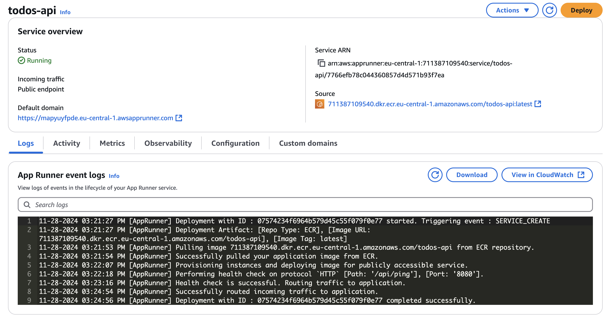
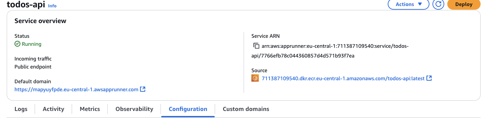

# Exercise 7: Deploy the Todos.Api project to AWS App Runner

In this exercise, you will deploy the Todos.Api project to AWS App Runner. AWS App Runner is a fully managed service that makes it easy for developers to quickly deploy containerized web applications and APIs at scale.

## Pre-requisites

- [Docker](https://docs.docker.com/get-docker/)
- [AWS account](https://aws.amazon.com/)
- [AWS CLI](https://docs.aws.amazon.com/cli/latest/userguide/cli-chap-install.html)
- **That you completed the exercise** [05-docker-push](../05-docker-push/README.md)

## Instructions

1. Login to your AWS account and navigate to the App Runner service by searching for it in the search bar:

2. Go to "Services".
3. Click "Create service" button
4. Select your ECR image registry as deployment source:

5. Set the deployment settings:

6. Click "Next".
7. Set the service settings:

8. Update the health check settings:

9. Make sure that Network settings are set to "Public":

> [!NOTE]
> Feel free to explore other settings and configurations available in AWS App Runner.

10. Click "Next".
11. Click "Create & deploy".
12. Go grab a coffee ☕️ while AWS App Runner deploys your application.
13. Once the deployment is complete, you will see the status of the service as "Running".

14. Check the domain of you service in the "Default domain" section:

15. Open your browser and navigate to: `http://{{DEFAULT_DOMAIN}}/api/ping` to see the result. You should see `pong unknown` in the browser.

16. Go to service configuration:

17.  Click on "Edit" in "Configure service" section.
18.  Update the environment variable `MY_NAME` with your name and click "Save".

19.  You should see the environment variable in the "Runtime environment variables" section:

20. Grab another coffee ☕️ while AWS App Runner updates your service.

21. Open your browser and navigate to: `http://{{DEFAULT_DOMAIN}}/api/ping` to see the result.

22. Congratulations! You have successfully deployed the Todos.Api project to AWS App Runner.

## Summary

In this exercise, you learned how to deploy the Todos.Api project to AWS App Runner. You configured the deployment settings, service settings, and environment variables. You also learned how to access the deployed service and update the environment variables.
