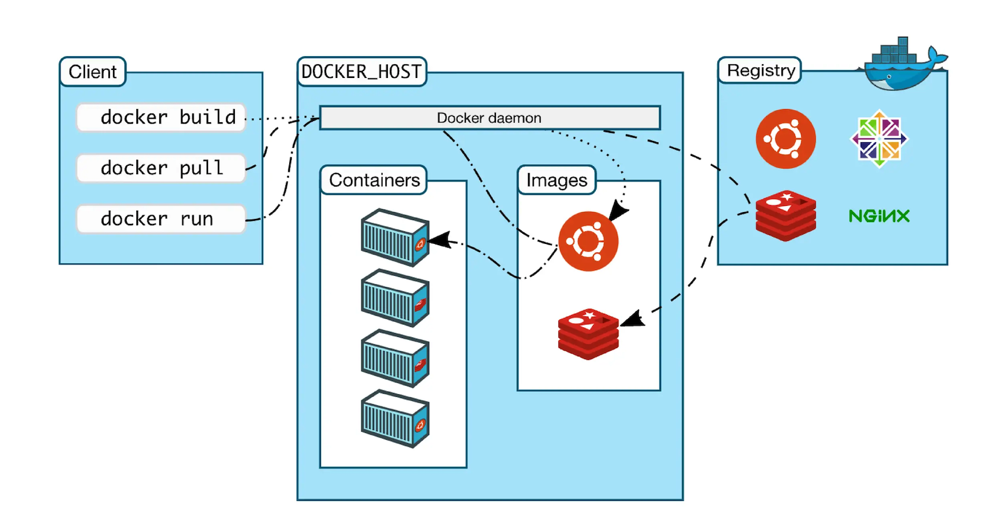
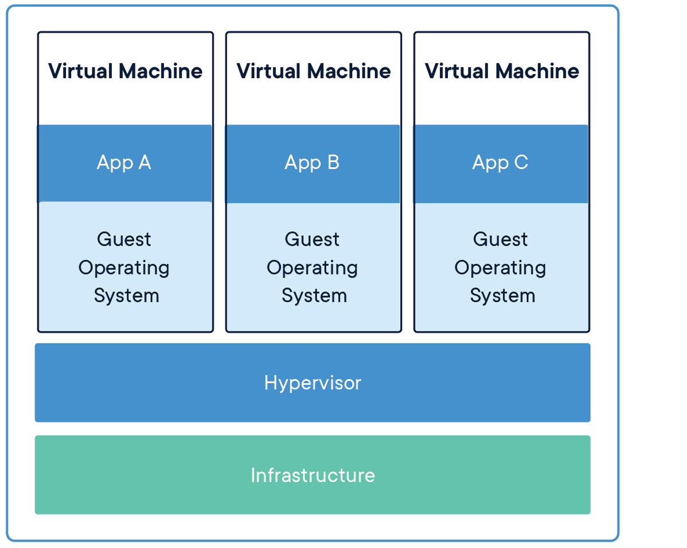
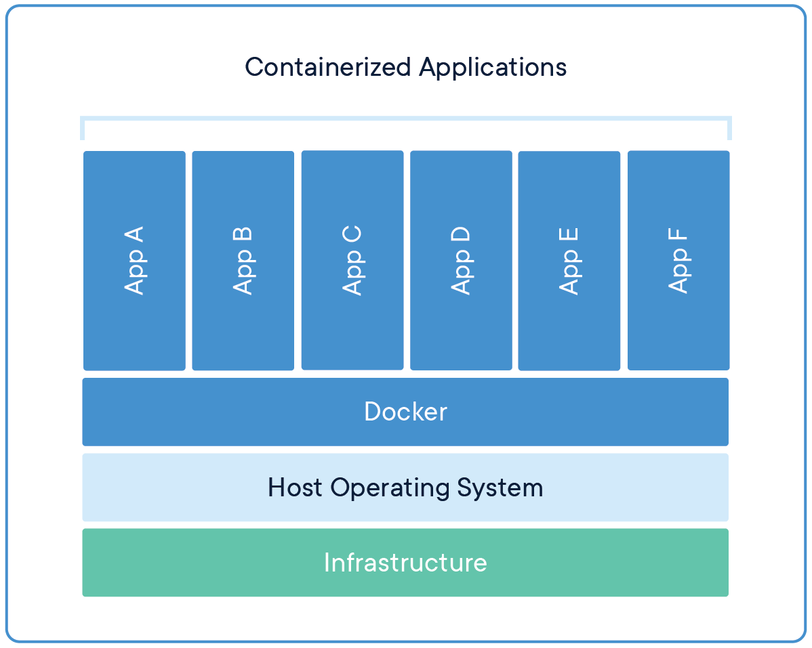

# What is Docker?

Docker is an open-source platform designed to help developers build, ship, and run applications in a consistent environment. By using containerization technology, Docker ensures that software behaves the same regardless of where it runs: on a developer's laptop, a testing environment, or a production server.

## Key Concepts of Docker

### Containers

- Lightweight, standalone, and executable packages that include everything needed to run an application: code, runtime, libraries, and dependencies.
- Isolated from each other, but can share the same operating system kernel.

### Docker Images

- A read-only template used to create Docker containers.
- Typically built using a Dockerfile, which contains instructions to set up the environment.
- Example: An image for a Python web app might include Python, necessary libraries, and the app code.

### Docker CLI (docker)

- A command-line interface for interacting with Docker Engine.
- Allows users to build, run, manage, and distribute Docker containers.

### Docker Engine (dockerd)

- The runtime responsible for managing containers.
- Includes container runtime for building, running, and managing containers.
- Provides an API that the Docker CLI communicates with.

### Docker Hub aka Image Registry (hub.docker.com)

- A cloud-based registry for sharing Docker images.
- Includes both official images (verified and maintained by Docker) and community-contributed images.
- There are other registries available like GitHub Container Registry, AWS Elastic Container Registry...



## Why Use Docker?

### Consistency Across Environments

- Eliminates the "works on my machine" problem by providing a consistent runtime environment.

### Portability

- Docker containers can run on any system that supports Docker, whether it's a local machine, a data center, or a cloud environment. All cloud providers (AWS, Azure, Google Cloud and many others) provide support for deploying Docker containers.

### Efficiency

- Containers share the host OS kernel, making them more lightweight compared to traditional virtual machines.
- Faster startup times and reduced resource usage. Typically a container starts in seconds, while a VM can take minutes.

### Scalability

- Containers can be easily scaled up or down based on demand.
- Tools like Docker Compose and Kubernetes help manage multi-container applications.

## Containers vs. Virtual Machines



- **Virtual Machines (VMs)**: Each VM includes a full copy of the operating system, application, libraries, and dependencies. VMs run on a hypervisor, which virtualizes hardware resources.



- **Containers**: Containers share the host OS kernel and only include the application and its dependencies. Containers run on a container runtime (like Docker Engine) that abstracts the OS kernel.

| Feature            | Docker Containers     | Virtual Machines                 |
| ------------------ | --------------------- | -------------------------------- |
| **Isolation**      | Process-level         | Full OS-level                    |
| **Startup Time**   | Seconds               | Minutes                          |
| **Resource Usage** | Shares host OS kernel | Full OS, more resource-intensive |
| **Portability**    | Highly portable       | Less portable                    |

# How does Docker actually work?

Docker uses features from the Linux kernel (like cgroups and namespaces) to create isolated environments called containers.

Namespaces provide isolation for processes, networking, and filesystems. Each container has its own namespace, making it appear as if it has its own instance of the OS - process running in a container can only see other processes in the same container, can only access the network interfaces and filesystems that are part of the container and nothing else from the host system.

To try it out yourself, you can run the following command to start a container with a different hostname:

```bash
docker run --hostname my-container -it ubuntu
```

Navigate to the `/etc/hostname` file inside the container to see the new hostname. See how the file system looks like try to **delete all files in the container and see what happens**.

Cgroups (control groups) manage resource allocation (CPU, memory, disk I/O) for containers. This ensures that containers are limited in their resource usage and do not starve other containers.

To try it out yourself, you can run the following command to limit the CPU usage of a container:

```bash
docker run --cpus 0.5 -it ubuntu
```

## Conclusion

Docker is a game-changer for modern software development and deployment. It simplifies the way developers build, test, and deploy applications, ensuring consistency, portability, and efficiency. By adopting Docker, teams can focus on creating great software without worrying about environment differences or compatibility issues.
